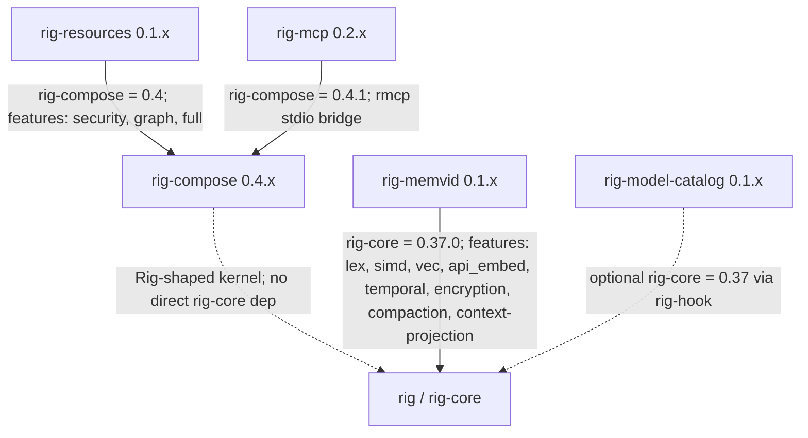

# rig-mcp

Model Context Protocol bridge for rig-compose tool registries. Wraps the official `rmcp` SDK with rig-compose's transport-agnostic Tool surface.

[](https://github.com/ForeverAngry/rig-mcp/actions/workflows/ci.yml)
[](https://crates.io/crates/rig-mcp)
[](https://docs.rs/rig-mcp)
[](#license)
[](#status)

## Overview

`rig-mcp` adapts Model Context Protocol endpoints into `rig-compose` tool registries. It uses the official `rmcp` SDK for protocol mechanics and exposes a small Rig-shaped surface: transports list remote tool schemas, call remote tools, and wrap those remote tools as `rig_compose::Tool` values.

Skills that receive a `ToolRegistry` cannot tell whether a tool is local, loopback, or served by a child process over MCP stdio.

## Why It Exists

`rig-compose` keeps tools transport-agnostic. MCP is a transport and protocol concern, so it belongs in a companion crate instead of the kernel. `rig-mcp` fills that gap by turning MCP-served tools into the same `Tool` trait used by local closures and in-process delegates.

It delegates JSON-RPC framing, capability handshakes, and protocol-version negotiation to `rmcp` rather than reimplementing the MCP spec.

## Status

- Crate version: `0.2.1`.
- Rust edition: 2024.
- MSRV: 1.88.
- `rig-compose` dependency: `version = "0.4.1"`.
- `rmcp` dependency: `1.6` with `client`, `server`, `macros`, `transport-io`, and `transport-child-process` features only.
- Current Unreleased work adds opt-in cached-result transport and page/release
    tools for oversized MCP array results.

The crate-local maturity plan lives in [ROADMAP.md](ROADMAP.md). Cross-crate
coordination lives in
[`rig-ecosystem/docs/roadmap.md`](../rig-ecosystem/docs/roadmap.md).

## Feature Flags

`rig-mcp` currently defines no crate features. `just check` runs clippy, tests, and docs with `--all-features` to keep future feature additions covered.

## Key Types

- [src/transport.rs](src/transport.rs): `McpTransport`, the async trait for MCP-like transports. It exposes `endpoint`, `list_tools`, and `call_tool`.
- [src/transport.rs](src/transport.rs): `McpTool`, the adapter that wraps one remote schema and transport as a local `rig_compose::Tool`.
- [src/transport.rs](src/transport.rs): `LoopbackTransport`, an in-process transport over `ToolRegistry` used for tests and embedding.
- [src/cache_tools.rs](src/cache_tools.rs): `CachedResultsTransport`,
    `CachedResultsConfig`, and `cache.page` / `cache.release` tool builders
    for model-boundary paging of oversized array results.
- [src/replay.rs](src/replay.rs): `RegistrationSnapshot`, an adapter-local
    snapshot of discovered remote tool descriptors that can replay `McpTool`
    registration after reconnects without pushing transport state into
    `rig-compose`.
- [src/stdio.rs](src/stdio.rs): `StdioTransport`, the production child-process stdio MCP client backed by `rmcp`.
- [src/stdio.rs](src/stdio.rs): `serve_stdio`, which exposes a `ToolRegistry` as an MCP tools-only server over the current process's stdin/stdout.

Server-side `tools/list` is answered from `ToolRegistry::descriptors`; `tools/call` dispatches to `ToolRegistry::invoke`. Client-side stdio calls are converted back into `ToolSchema` and JSON `Value` results.

## Integration With Rig

`rig-mcp` integrates through `rig-compose`, not directly through `rig-core`. A remote MCP tool becomes a `rig_compose::Tool`, so any `rig-compose` skill or agent can call it through a normal `ToolRegistry`.

This preserves the same call shape across local tools, `LoopbackTransport`, `StdioTransport`, and future transports.

## Quick start

The loopback path is covered by tests in [src/transport.rs](src/transport.rs). This example mirrors `mcp_tool_indistinguishable_from_local`.

[tests/harness.rs](tests/harness.rs) exercises the same weather task through a
local `ToolRegistry`, a `LoopbackTransport`, and a real child-process
`StdioTransport`. It records task input, endpoint, discovered tool names,
normalized invocation, dispatch result, final answer, and passed assertions so
local and MCP-backed tools stay indistinguishable to registry callers.

```rust,no_run
use std::sync::Arc;

use rig_compose::{LocalTool, ToolRegistry, ToolSchema};
use rig_mcp::{LoopbackTransport, McpTool, McpTransport};
use serde_json::json;

# async fn run() -> Result<(), rig_compose::KernelError> {
let server = ToolRegistry::new();
server.register(Arc::new(LocalTool::new(
    ToolSchema {
        name: "math.add".into(),
        description: "add two integers".into(),
        args_schema: json!({"type": "object"}),
        result_schema: json!({"type": "integer"}),
    },
    |args| async move {
        let a = args.get("a").and_then(serde_json::Value::as_i64).unwrap_or(0);
        let b = args.get("b").and_then(serde_json::Value::as_i64).unwrap_or(0);
        Ok(json!(a + b))
    },
)));

let transport: Arc<dyn McpTransport> =
    Arc::new(LoopbackTransport::new("loopback://test", server));

let client = ToolRegistry::new();
for tool in McpTool::from_transport(transport).await? {
    client.register(tool);
}

let output = client.invoke("math.add", json!({"a": 10, "b": 32})).await?;
assert_eq!(output, json!(42));
# Ok(()) }
```

Production stdio behavior is implemented in [src/stdio.rs](src/stdio.rs). `serve_stdio` exposes a local `ToolRegistry`; `StdioTransport::spawn` starts a child process and speaks MCP over its stdio.

[tests/stdio_failures.rs](tests/stdio_failures.rs) exercises a real child-process fixture for successful stdio calls, unknown tools, missing arguments, wrong argument types, malformed child output, and child exit before handshake.
[tests/result_envelope.rs](tests/result_envelope.rs) verifies that oversized
stdio tool results round-trip as raw structured MCP output and can then be
bounded with `rig_compose::bound_tool_result`, producing deterministic
truncation metadata without adding per-transport clamping.
The `result_cache` module uses the same model-boundary vocabulary for cached
array pages: `CachedResultEnvelope` includes `truncated`, `omitted_items`, and
`page_token` metadata next to the cache handle, total item count, page size,
and first page preview.
`CachedResultsTransport` wraps any `McpTransport` and applies that envelope
only after a remote call returns an oversized array. Register `cache.page` and
`cache.release` with `register_cache_tools` so the model can page through and
release handles using normal `rig_compose::Tool` calls.

## Validation

Canonical validation is `just check`.

That recipe runs formatter checks, `cargo clippy --all-targets --all-features -- -D warnings`, `cargo test --all-targets --all-features`, and rustdoc with all features and `-D warnings -D rustdoc::broken_intra_doc_links`.

## Gotchas

- Error handling surfaces `rig_compose::KernelError`; the crate does not introduce a separate public error enum.
- The `rmcp` feature surface is intentionally tight. Do not enable extra transports or HTTP/TLS by default without a concrete need.
- `StdioTransport` caches the cloneable `rmcp::Peer` and keeps the running service alive with an `Arc<RunningService<...>>`; dropping the transport drops the service and closes the child stdio.
- `StdioTransport::call_tool` accepts object or null arguments. Other JSON shapes return `KernelError::InvalidArgument`.
- MCP transports preserve structured tool output. Apply `rig_compose::bound_tool_result` at the dispatch/model-boundary layer when large object/string results need deterministic truncation metadata; use `CachedResultsTransport` plus `register_cache_tools` when oversized array results should remain page-addressable by handle.
- Reconnect replay is adapter-owned. Use `RegistrationSnapshot::discover`,
    `RegistrationSnapshot::from_registry`, and `RegistrationSnapshot::replay_into`
    for transports that can reconnect; do not store replay state in
    `ToolRegistry`.

## Ecosystem

These companion crates are maintained as separate repositories. Together they form a small stack around the upstream Rig project: `rig-compose` provides the kernel surface, `rig-resources` contributes reusable skills and tools, `rig-mcp` moves tools across MCP, `rig-memvid` connects Rig agents to persistent `.mv2` memory, and `rig-model-catalog` abstracts LLM metadata and probes.



Pinned Rig-facing dependencies from the current manifests:

| Crate | Direct Rig-facing dependency | Notes |
| --- | --- | --- |
| `rig-compose` | none | Defines a Rig-shaped kernel surface without depending on `rig-core`. |
| `rig-resources` | `rig-compose = 0.4` | Provides reusable skills, resource tools, and security helpers. |
| `rig-mcp` | `rig-compose = 0.4.1` | Bridges `rig-compose` tools over MCP stdio and loopback transports. |
| `rig-memvid` | `rig-core = 0.37.0`; optional `rig-compose = 0.4` | Implements Rig vector-store, prompt-hook, compaction, and context-projection flows over Memvid. |
| `rig-model-catalog` | optional `rig-core = 0.37` via `rig-hook` | Provides standalone model traits plus optional Rig prompt-hook telemetry. |

The concrete multi-crate workflow tested today is the MCP loopback path: a `rig_compose::ToolRegistry` is exposed through `rig_mcp::LoopbackTransport`, remote schemas are wrapped as `rig_mcp::McpTool`, and the wrapped tools are registered back into another `ToolRegistry`. That proves a local `rig-compose` tool and an MCP-adapted tool are indistinguishable to callers. The backing test is `mcp_tool_indistinguishable_from_local` in [rig-mcp/src/transport.rs](https://github.com/ForeverAngry/rig-mcp/blob/main/src/transport.rs).

## License

Licensed under either Apache-2.0 or MIT, at your option.
